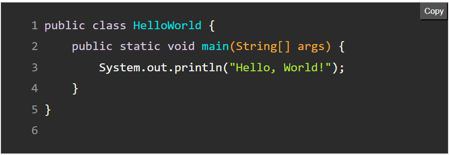
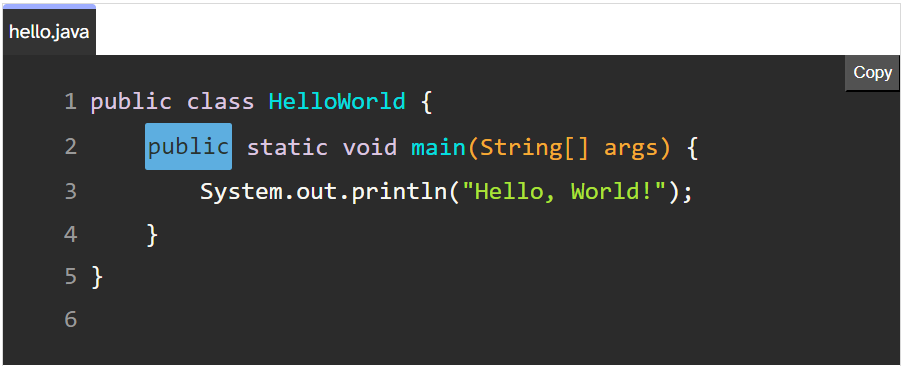
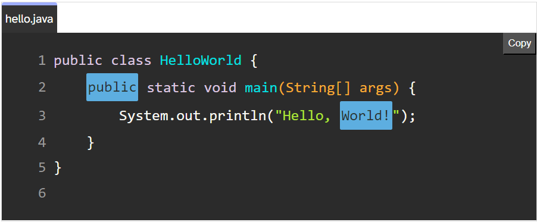
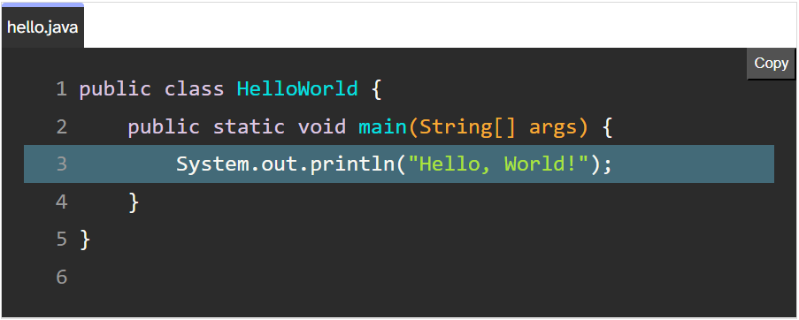

# Highlight Hero

Highlight Hero is a powerful library designed to highlight code in Markdown content. It comes packed with a variety of features to enhance the presentation and functionality of code snippets in your blogs, documentation, and more.

## Features
- `Line Highlighting:` Highlight specific lines within your code snippets, just like GitHub.
- `Word Highlighting:` Emphasize important words or sections within your code.
- `Copy to Clipboard:` Easily copy code snippets to your clipboard with a single click.
- `Line Numbering:` Display line numbers alongside your code for easy reference.
- `File Naming:` Show the name of the file from which the code snippet originates.
- `Syntax Error Detection:` Ensure your code is error-free for users.

## Installation 

To install Highlight Hero, you can use npm:
```
npm install highlight-hero
```

## Usage

Highlight Hero is designed to be easy to use and integrate into your projects. Simply import the library and use the provided functions to highlight your code snippets.

```js
import HighlightHero from 'dist/highlight-hero.js';

// Markdown String can come from anywhere ( maybe some backend )
// Note it should start and end with 3 backticks (```)
const markdownText = "";

// Initialize the class
const highlighter = new HighlightHero();

// Transform markdown code content
const html = highlighter.HighlightCode(markdownText);

// Display transformed HTML or store it somewhere
document.getElementById('result').innerHTML = html;
```

You are provided with bunch of options that can be directly used in your markdown 

## Code Highlighting 

Nothing special just write your markdown code(along with language mentioned or not) as you normally would and it will be highlighted. 

````markdown
```java
public class HelloWorld {
    public static void main(String[] args) {
        System.out.println("Hello, World!");
    }
}
````


### Line Numbering

To add line numbering just use `ln` keyword anywhere in 1st line of markdown code.

````markdown
```java ln
public class HelloWorld {
    public static void main(String[] args) {
        System.out.println("Hello, World!");
    }
}
````




### File Naming

Use the `name` keyword to give name to the file your are writing

````markdown 
```java ln name={"hello.java"}
public class HelloWorld {
    public static void main(String[] args) {
        System.out.println("Hello, World!");
    }
}
````


### Word Highlighting

Mention the words you want to highlight with `wh` keyword and inside curly braces with space seperation

1. Highlight a particular word in whole block

````markdown
```java ln name={"hello.java"} wh={public}
public class HelloWorld {
    public static void main(String[] args) {
        System.out.println("Hello, World!");
    }
}
````


2. Highlight a particular word in a particular line

````markdown
```java ln name={"hello.java"} wh={public,2}
public class HelloWorld {
    public static void main(String[] args) {
        System.out.println("Hello, World!");
    }
}
````




3. Highlight multiple words 

````markdown
```java ln name={"hello.java"} wh={public,2 World!}
public class HelloWorld {
    public static void main(String[] args) {
        System.out.println("Hello, World!");
    }
}
````




### Line Highlighting

Mention the lines you want to highlight with `lh` keyword and inside curly braces with space seperation

1. Highlight a particular line

````markdown
```java ln name={"hello.java"} lh={3}
public class HelloWorld {
    public static void main(String[] args) {
        System.out.println("Hello, World!");
    }
}
````



2. Highlight a code block (multiple lines)

````markdown
```java ln name={"hello.java"} lh={2-4}
public class HelloWorld {
    public static void main(String[] args) {
        System.out.println("Hello, World!");
    }
}
````


3. Highlight multiple Code Blocks

````markdown
```java ln name={"hello.java"} lh={3 7-9}
public class HelloWorld {

    public static findSum(int a, int b){
        return a+b;
    }

    public static void main(String[] args) {
        System.out.println("Hello, World!");
    }
}
````


4. Highlight lines with Accepted and Rejected Colors (just like github's)

````markdown
```java ln name={"hello.java"} lh={3,G 7-9,R}
public class HelloWorld {

    public static findSum(int a, int b){
        return a+b;
    }

    public static void main(String[] args) {
        System.out.println("Hello, World!");
    }
}
````


### Syntax Error Detection and Display 

- Use the `check` keyword if you want to check for syntax errors in the code block.

- This is one of the important features as I was tired of copying wrong code from websites, hence your users can see if there are syntax errors right on your blog itself. 

- For now only `java` and `javascript` is supported. 


````markdown
```java ln name={"hello.java"} check
public class HelloWorld {    
    public static void main(String[ args) {
        System.out.println("Hello, World!");
    }
}
````


## Integration into your Site 

```
npm install highlight-hero
```

Once you have downloaded the highlight-hero you will be able to see dist folder with 2 files highlight-hero.js and highlight-hero.css. These 2 files are all it takes to beautify your code. 

### Integrate with Plain Html

```
<!DOCTYPE html>
<html lang="en">
<head>
  <meta charset="UTF-8">
  <meta name="viewport" content="width=device-width, initial-scale=1.0">
  <title>Markdown Highlighter</title>
  // Stylesheet
  <link rel="stylesheet" href="../dist/highlight-hero.css">
</head>

<body>
  <h1>Markdown Code Highlighter</h1>

  <div id="result"></div>

  <script type="module">

    import HighlightHero from '../dist/highlight-hero.js';
    
    const markdownText = `
\`\`\`java ln check lh={2-4} name={"SomeName.java"}
    import java.util.*;
    clss Arjit{
      public static void main(String s[]){
        System.out.println("Hello World");
      }
    }
\`\`\`
`;

    const highlighter = new HighlightHero();

    const html = highlighter.HighlightCode(markdownText);

    document.getElementById('result').innerHTML = html;
  </script>
</body>
</html>
```


### Integrate with React app 

```
import { useEffect, useState } from 'react'
import HighlightHero from '../node_modules/highlight-hero';  // Adjust the path if necessary

function App() {
  const [highlightedCode, setHighlightedCode] = useState('');

  useEffect(() => {
    const markdownText = `
\`\`\`java ln check
    import java.util.*;
    class Arjit{
      public static void main(String s[]){
        System.out.println("Hello World");
      }
    }
\`\`\`
    `;

    const highlighter = new HighlightHero();
    const html = highlighter.HighlightCode(markdownText);

    setHighlightedCode(html);
  }, []);

  return (
    <>
     <div>
      <h1>Markdown Code Highlighter</h1>
      <div id="result" dangerouslySetInnerHTML={{ __html: highlightedCode }}></div>
    </div>
    </>
  )
}

export default App
```

### Integration with Astro 

This library was written for Astro and once you have your astro integration in place all you need to worry about is write your blogs in markdown format and nothing else. 

`Step 1:` : Create a file named `astro-highlight-hero.js` in the root of your astro website.

```
import HighlightHero from 'highlight-hero';
import { visit } from 'unist-util-visit';

const highlighter = new HighlightHero();

export default function astroHighlightHero() {
  return {
    name: 'astro-highlight-hero',
    hooks: {
      'astro:config:setup': ({ updateConfig }) => {
        updateConfig({
          markdown: {
            remarkPlugins: [
              () => async (tree) => {

                visit(tree, 'code', (node) => {
                  const { lang, meta, value } = node;
                  if (value) {
                    
                    const codeBlock = `\`\`\`${lang || ''} ${meta || ''}\n${value}\n\`\`\``;
                    
                    const highlightedCode = highlighter.HighlightCode(codeBlock);

                    node.type= 'html';
                    node.value = highlightedCode;
                  }
                });
              },
            ],
          },
        });
      },
    },
  };
}
```


`Step 2:` : Add the integration in `astro.config.mjs`

```
import { defineConfig } from 'astro/config';
import mdx from '@astrojs/mdx';
import astroHighlightHero from './astro-highlight-hero';

import sitemap from '@astrojs/sitemap';

// https://astro.build/config
export default defineConfig({
	site: 'https://example.com',
	integrations: [mdx(), sitemap(), astroHighlightHero()],
});

```


`Step 3:` : Start writing markdown files and you are good to go. 

## Contributing

If you have any suggestions, bug reports, or feature requests, feel free to open an issue or submit a pull request. Your feedback is highly appreciated. We are always looking for ways to improve Highlight Hero and make it more useful for developers.